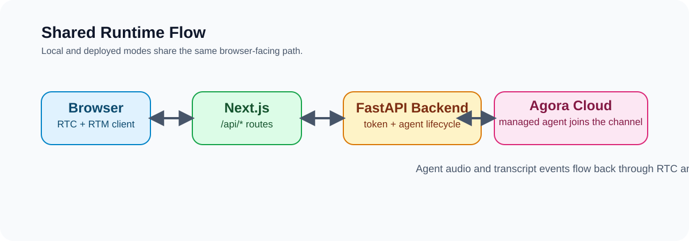

# VaayuMitra — Bharat's Voice-Native मौसम Intelligence

[](./LICENSE)
[](https://www.python.org/)
[](https://bun.sh/)

IMD-grounded voice intelligence for farmers, fishermen, and disaster teams — district forecasts, sea-state and cyclone alerts in your language, no typing or English needed. Powered by the Agora Conversational AI Engine, Next.js web client, and Python FastAPI backend with a FastMCP tool layer. Features specialized personas (farmer, fisherman, disaster relief), real-time weather alerts, Cyclone eAtlas maps, and regional language support (Hindi, Bhojpuri, Marathi, and more).

## Prerequisites

- [Python 3.10+](https://www.python.org/)
- [Bun](https://bun.sh/)
- [Agora CLI](https://github.com/AgoraIO/cli) (optional, for project doctor and credential export)

## Starting the Project

### 1. Quick Start (Run Everything)

To start both the FastAPI backend and Next.js frontend concurrently with one command:

```bash
bun run dev
```

This starts:
- **Frontend:** [http://localhost:3000](http://localhost:3000)
- **Backend API:** [http://localhost:8000](http://localhost:8000)
- **Interactive API Docs:** [http://localhost:8000/docs](http://localhost:8000/docs)
- **Health Check:** [http://localhost:8000/health](http://localhost:8000/health)
- **FastMCP Endpoint:** [http://localhost:8000/mcp](http://localhost:8000/mcp)

### 2. Starting Services Separately

If you prefer to run services in separate terminal windows for isolated logs and debugging:

#### Backend (FastAPI + Agora Agent + FastMCP)
```bash
# Cross-platform (Windows / macOS / Linux):
bun run backend

# Or via Python directly:
# Linux / macOS:
cd server && source venv/bin/activate && python src/server.py

# Windows (PowerShell):
cd server; .\venv\Scripts\python.exe src\server.py
```

#### Frontend (Next.js 16 + React 19 + Agora Agent UIKit)
```bash
# Cross-platform (Windows / macOS / Linux):
bun run frontend

# Or directly in web/:
cd web && bun run dev
```

### 3. First-Time Setup & Installation

If running for the first time or after a fresh git clone:

```bash
# Install root and workspace dependencies
bun install

# Prepare environment files and python dependencies
bun run setup
```

Configure your Agora credentials in `server/.env`:
```bash
AGORA_APP_ID=your_agora_app_id
AGORA_APP_CERTIFICATE=your_agora_app_certificate
```

### 4. Verification

Confirm both services are running and healthy:
```bash
# Check backend health
curl http://localhost:8000/health

# Check API proxy through frontend
curl http://localhost:3000/api/get_config
```

## Deploy

Deploy `web` as a Next.js app (Vercel Hobby) and `server` as a reachable Python service
(Render Free via `render.yaml` Blueprint). This is plan.md Step 6.1.

1. **Backend (Render):** Dashboard -> New -> Blueprint -> select this repo's `render.yaml`.
   Set secrets (`AGORA_APP_ID`, `AGORA_APP_CERTIFICATE`, `SARVAM_API_KEY`) in the
   dashboard — never commit them. After the first deploy, set `BACKEND_URL` to the
   live `https://<service>.onrender.com` URL and redeploy.
2. **Why HTTPS matters:** Agora calls `llm.mcp_servers` server-side, so `/mcp` must be
   public HTTPS in prod. `GET /health` reports `mcp_url` + `mcp_public_https` — check it
   before any voice session.
3. **Frontend (Vercel):** import `web/`, set `AGENT_BACKEND_URL` to the Render URL
   (see `web/.env.example`). Browser-facing `/api/*` routes in Next proxy to FastAPI via:

```bash
AGENT_BACKEND_URL=https://your-python-backend.example.com
```

4. **Verify a deployment:**

```bash
BACKEND_URL=https://your-python-backend.example.com bash scripts/verify-deploy.sh
```

This curls `/health` (expects `status: ok`, `agora_configured: true`,
`mcp_public_https: true`) and `POST /mcp` `tools/list`. Then run one full voice
session via the production URL per plan.md 6.1.

### Phone calls (Telephony Beta, plan.md 6.3)

- **Without the Beta (today):** use the phone-bridge fallback — start a conversation
  on the laptop, call it from any phone on speaker, hold the phone near the mic.
  Same voice loop, zero PSTN cost.
- **With the Beta:** request via Console → Talk to Us (mention SIH26068), set
  `TELEPHONY_ENABLED=true` + `TELEPHONY_FROM_NUMBER` (+ `CUSTOMER_ID`/`CUSTOMER_SECRET`),
  redeploy, point the Console webhook at `POST /telephonyWebhook`. Then dial from the
  pre-call Phone Call panel (`POST /dial`, E.164) and end with `POST /hangup`.


Set backend env values:

```bash
AGORA_APP_ID=your_agora_app_id
AGORA_APP_CERTIFICATE=your_agora_app_certificate
```

To export local env values from the Agora CLI-bound project:

```bash
agora project use <your-project>
agora quickstart env write .
rg "^(AGORA_APP_ID|AGORA_APP_CERTIFICATE)=" server/.env
```

## Environment variables

Primary backend env file: [`server/.env.example`](server/.env.example).

| Variable | Required | Default | Notes |
| --- | :---: | :---: | --- |
| `AGORA_APP_ID` | ✅ | — | Agora Console -> Project -> App ID |
| `AGORA_APP_CERTIFICATE` | ✅ | — | Agora Console -> Project -> App Certificate (server only) |
| `PORT` |  | `8000` | FastAPI server port (Render injects its own) |
| `AGENT_BACKEND_URL` (web deploy) | ✅ | — | Required in deployed `web` app when proxying to external FastAPI |
| `BACKEND_URL` (server deploy) | ✅ | — | Public https backend URL; defaults `llm.mcp_servers` to `{BACKEND_URL}/mcp` |
| `FRONTEND_URL` (server deploy) | ✅ | — | Vercel URL (comma-separated ok) for CORS; localhost allowed by default |

> **Default vs BYOK** — this quickstart defaults to Agora-managed STT + LLM + TTS in the backend. Enable BYOK by uncommenting provider blocks in `server/src/agent.py` and adding matching keys.

## Commands

```bash
# Starting the app
bun run dev             # Start both backend (8000) and frontend (3000) concurrently
bun run backend         # Start FastAPI backend standalone
bun run frontend        # Start Next.js frontend standalone

# Setup & Environment
bun run setup           # Run full setup (env files + dependencies)
bun run setup:env       # Prepare server/.env from template

# Quality & Verification
bun run verify          # Full web verification (doctor + contracts + build)
bun run verify:backend  # Python syntax/compilation checks
pytest server/tests     # Run 200+ backend unit and integration tests
bun test                # Run frontend unit tests (in web/)
```

## Architecture

<picture>
  <source media="(prefers-color-scheme: dark)" srcset="./.github/images/system-architecture-dark.svg">
  
</picture>

The browser talks to Next.js `/api/*` routes. In local mode, Next rewrites those routes to FastAPI using `AGENT_BACKEND_URL=http://localhost:8000`; FastAPI owns token generation and agent start/stop logic.

## What You Get

- Next.js web client (`web/`) with transcript UI and agent visualizer
- FastAPI backend (`server/`) for token generation and agent lifecycle
- `/api/get_config`, `/api/startAgent`, and `/api/stopAgent` browser-facing contract
- Managed default pipeline (Deepgram STT, OpenAI LLM, MiniMax TTS)

## How It Works

1. Browser requests connection config from `/api/get_config`.
2. Backend generates combined RTC+RTM config and returns channel + token.
3. Browser joins RTC/RTM and starts streaming audio.
4. Browser calls `/api/startAgent`; backend starts the cloud agent session.
5. Browser receives transcript and state updates over RTM, and `/api/stopAgent` ends the session.

## Repo Map

- `web/` — Next.js 16 + React 19 + TypeScript frontend
- `server/` — Python FastAPI backend + Agora Agent Server SDK integration
- `ARCHITECTURE.md` — system-level flow and ownership boundaries
- `AGENTS.md` — contributor agent instructions

## Troubleshooting

- **Agent does not join or transcripts are missing:** run `agora project doctor --deep`.
- **Missing credentials:** run `agora quickstart env write .`.
- **Auth errors from backend:** confirm `AGORA_APP_ID` and `AGORA_APP_CERTIFICATE` are set in `server/.env`.
- **Frontend cannot reach backend:** confirm `AGENT_BACKEND_URL=http://localhost:8000` in local frontend scripts.
- **Unsure who owns `/api/*`:** Next owns browser-facing `/api/*`; FastAPI owns `/get_config`, `/startAgent`, `/stopAgent`.

## More Docs

- [ARCHITECTURE.md](./ARCHITECTURE.md)
- [AGENTS.md](./AGENTS.md)
- [docs/ai/L1/02_architecture.md](./docs/ai/L1/02_architecture.md) — full-stack topology and lifecycle
- [docs/ai/L1/03_code_map.md](./docs/ai/L1/03_code_map.md) — curated `web/` + `server/` file map

## License

Released under the [MIT License](./LICENSE).
